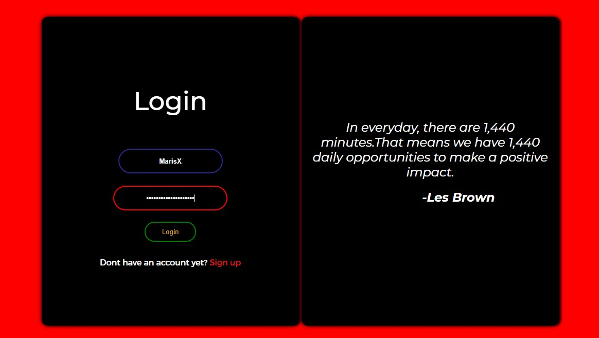
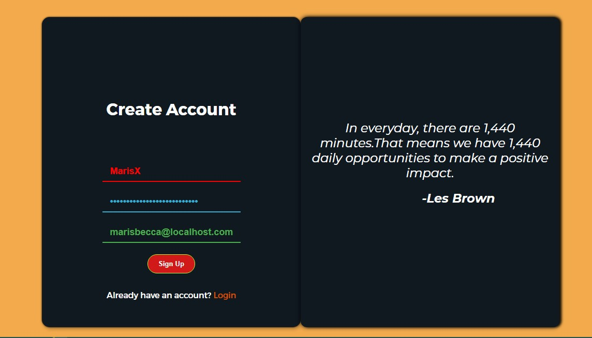
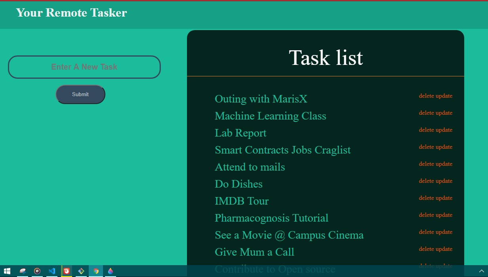

<!-- PROJECT LOGO -->
<br />
<p align="center">
  <a href="https://github.com/Darepapi/flask_todo_app">
    
  </a>

  <h2 align="center">Full-Stack-Todo-App</h2>

  <p align="center">
    An awesome todo app to task your day!
    <br />
    <a href="https://github.com/Darepapi/flask_todo_app"><strong>Explore the docs »</strong></a>
    <br />
    <br />
    <a href="https://github.com/Darepapi/flask_todo_app">View Demo</a>
    ·
    <a href="https://github.com/Darepapi/flask_todo_app/issues">Report Bug</a>
    ·
    <a href="https://github.com/Darepapi/flask_todo_app/issues">Request Feature</a>
  </p>
</p>


<!-- TABLE OF CONTENTS -->
## Table of Contents

* [About the Project](#about-the-project)
  * [Built With](#built-with)
* [Getting Started](#getting-started)
  * [Prerequisites](#prerequisites)
  * [Installation](#installation)
* [Contributing](#contributing)
* [License](#license)
* [Contact](#contact)
* [Acknowledgements](#acknowledgements)


<!-- ABOUT THE PROJECT -->
# About The Project

  This is just a simple todo app which is implemented using flask framework as the server side, MySQL as the database and HTML,
   CSS for a simple, nice and colorful user interface.


# Built With

* Python
* Flask
* Flask-Login
* Werkzeug
* MySQL
* HTML
* CSS


<!-- GETTING STARTED -->
# Getting Started

To get a local copy up and running follow these simple steps listed below.

## Prerequisites

* Python
```sh
Download python at https://www.python.org
```

* Flask
```sh
pip install Flask
```

* Flask-login
```sh
pip install Flask-login
```

* MySql
```sh
You can get a community edition at https://dev.mysql.com/downloads/mysql/
```

* Werkzeug
```sh
auto installed with flask
```

## Installation

1. Clone the repo
```sh
git clone https://github.com/Darepapi/flask_todo_app.git
```

2. Create MySql Database
```sh
CREATE DATABASE your_database_name;
USE your_database_name;
```

3. Import MySql Database
```sh
source todo_db.sql;
```

4. Enter Mysql connection details in app.py
```sh
app.config['MYSQL_DB'] = 'your_database_name'
```


<!-- USAGE EXAMPLES -->
## SCREENSHOTS










<!-- CONTRIBUTING -->
## Contributing

Contributions are what make the open source community such an amazing place to be learn, inspire, and create. Any contributions you make are **greatly appreciated**.

1. Fork the Project
2. Create your Feature Branch (`git checkout -b feature/AmazingFeature`)
3. Commit your Changes (`git commit -m 'Add some AmazingFeature'`)
4. Push to the Branch (`git push origin feature/AmazingFeature`)
5. Open a Pull Request


<!-- LICENSE -->
## License

Distributed under the MIT License. See `LICENSE` for more information.


<!-- CONTACT -->
## Contact

Afolabi Dare - [@thepharmProg](https://twitter.com/thepharmProg) - mandatedisrael@gmail.com
[Linkedin](https://linkedin.com/in/afolabi-dare)

Project Link: [https://github.com/Darepapi/flask_todo_app](https://github.com/Darepapi/flask_todo_app)


<!-- ACKNOWLEDGEMENTS -->
## Acknowledgements

* [Garantor](https://github.com/garantor)
